# Angular

* https://angular.io

### Set Up Node.js

* https://nodejs.org

### Use LTS version 14.17.X of Node.js

* https://nodejs.org/en/

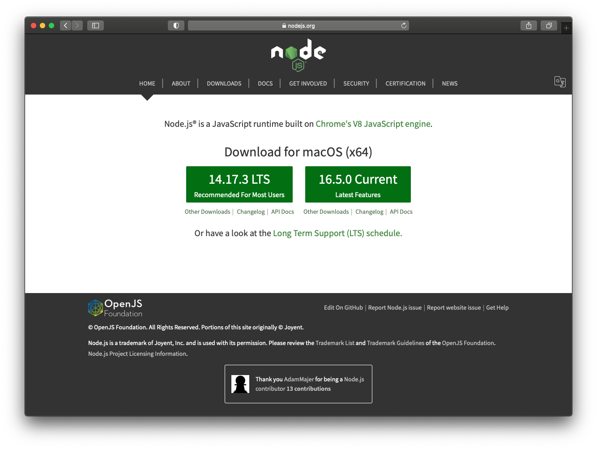
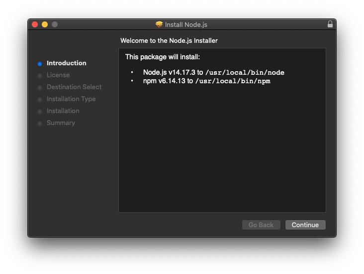

## Getting Started (Local)

* https://angular.io/guide/setup-local

### Install the Angular CLI

* https://www.npmjs.com/package/@angular/cli

You use the Angular CLI to create projects, generate application and library code, and perform a variety of ongoing development tasks such as testing, bundling, and deployment.

To install the Angular CLI, open a terminal window and run the following command:

```      
npm install -g @angular/cli  (for latest)
```
or

```
npm install -g @angular/cli@11 (for specific version)
```

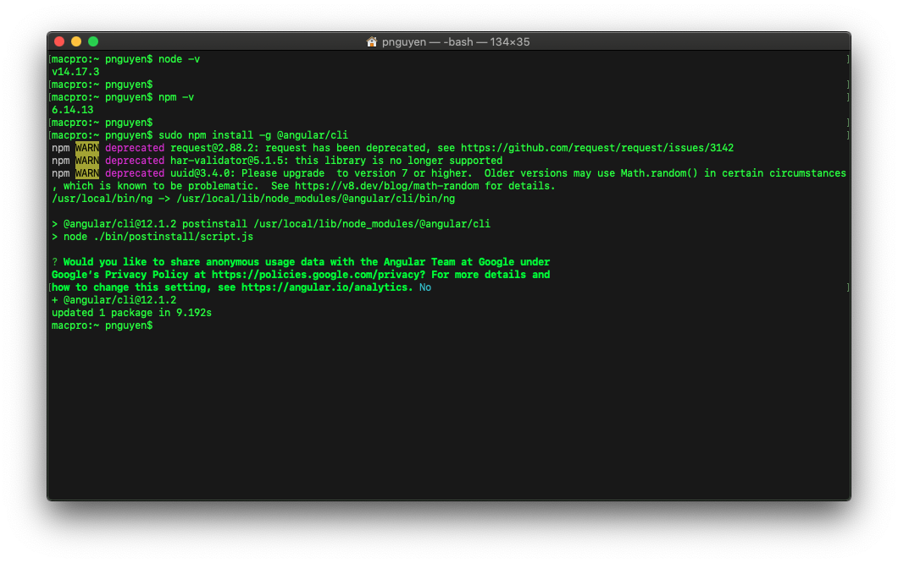
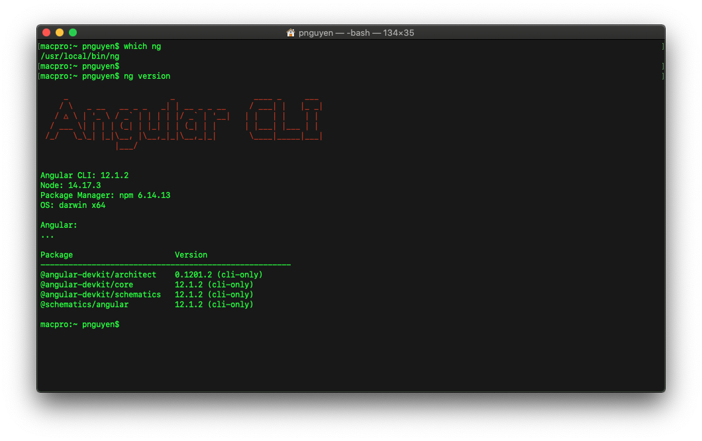

For Angular Updates:

* https://update.angular.io

For clean uninstall:

```
npm uninstall -g @angular/cli
npm cache clean
npm install -g @angular/cli@11
```

### Create a workspace and initial application

You develop apps in the context of an Angular workspace.

To create a new workspace and initial starter app:

* Run the CLI command ng new and provide the name my-app, as shown here:

  ```
  ng new my-app
  ```
  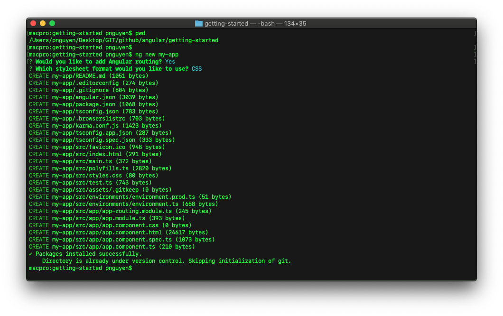
 
        
* The ng new command prompts you for information about features to include in the initial app. Accept the defaults by pressing the Enter or Return key.

The Angular CLI installs the necessary Angular npm packages and other dependencies. This can take a few minutes.

The CLI creates a new workspace and a simple Welcome app, ready to run.


### Run the application

The Angular CLI includes a server, so that you can build and serve your app locally.

* Navigate to the workspace folder, such as my-app.
* Run the following command:

```    
cd my-app
ng serve --open
```

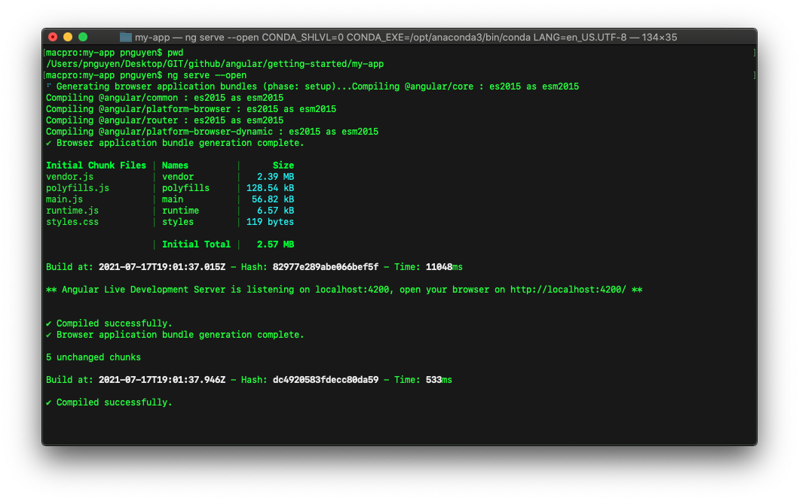    

The ng serve command launches the server, watches your files, and rebuilds the app as you make changes to those files.

The --open (or just -o) option automatically opens your browser to http://localhost:4200/.

If your installation and setup was successful, you should see a page similar to the following.

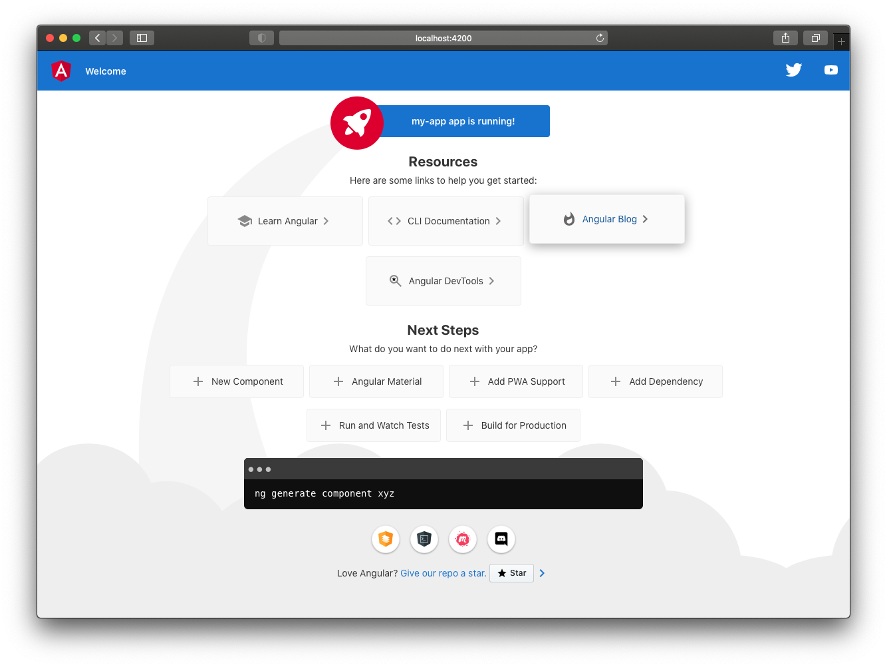


### Next steps

* Angular Concepts: https://angular.io/guide/architecture
* Angular Glossary: https://angular.io/guide/glossary
* Tour of Heroes Tutorial: https://angular.io/tutorial
* CLI Overview: https://angular.io/cli
* Workspace and Project File Structure: https://angular.io/guide/file-structure 

1. For a more thorough introduction to the fundamental concepts and terminology of Angular single-page app architecture and design principles, read the Angular Concepts section.

2. Work through the Tour of Heroes Tutorial, a complete hands-on exercise that introduces you to the app development process using the Angular CLI and walks through important subsystems.

3. To learn more about using the Angular CLI, see the CLI Overview. In addition to creating the initial workspace and app scaffolding, you can use the CLI to generate Angular code such as components and services. The CLI supports the full development cycle, including building, testing, bundling, and deployment.

4. For more information about the Angular files generated by ng new, see Workspace and Project File Structure.


## Getting Started (StackBlitz)

* https://angular.io/start

### Create the sample project

To create the sample project, generate the ready-made sample project in StackBlitz. To save your work:

1. Log into StackBlitz.
2. Fork the project you generated.
3. Save periodically.

In StackBlitz, the preview pane on the right shows the starting state of the example application. The preview features two areas:

* A top bar with the store name, My Store, and a checkout button
* A header for a product list, Products

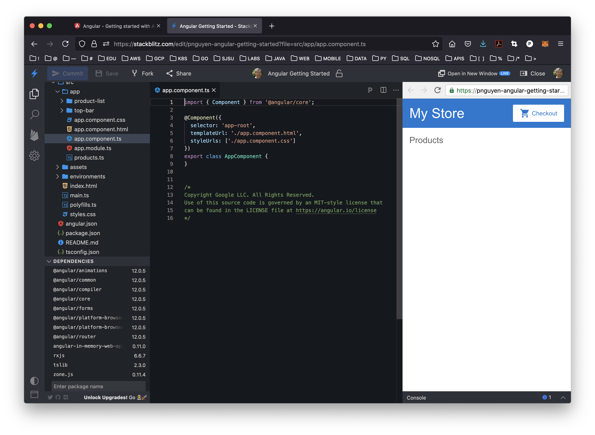

The project section on the left shows the source files that make up the application, including the infrastructure and configuration files.

When you generate the StackBlitz example applications that accompany the tutorials, StackBlitz creates the starter files and mock data for you. The files you use throughout the tutorial are in the src folder.

For more information on how to use StackBlitz, see the StackBlitz documentation.  

* https://developer.stackblitz.com/docs/platform/

### Create the product list

In this section, you'll update the application to display a list of products. You'll use predefined product data from the products.ts file and methods from the product-list.component.ts file. This section guides you through editing the HTML, also known as the template.

1. In the product-list folder, open the template file product-list.component.html.

2. Add an *ngFor structural directive on a ```<div>```, as follows.

* src/app/product-list/product-list.component.html

```   
	<h2>Products</h2>
	<div *ngFor="let product of products">
	</div>
```

* With ```*ngFor```, the ```<div>``` repeats for each product in the list.

* Structural directives shape or reshape the DOM's structure, by adding, removing, and manipulating elements. For more information about structural directives, see Structural directives.

* https://angular.io/guide/structural-directives

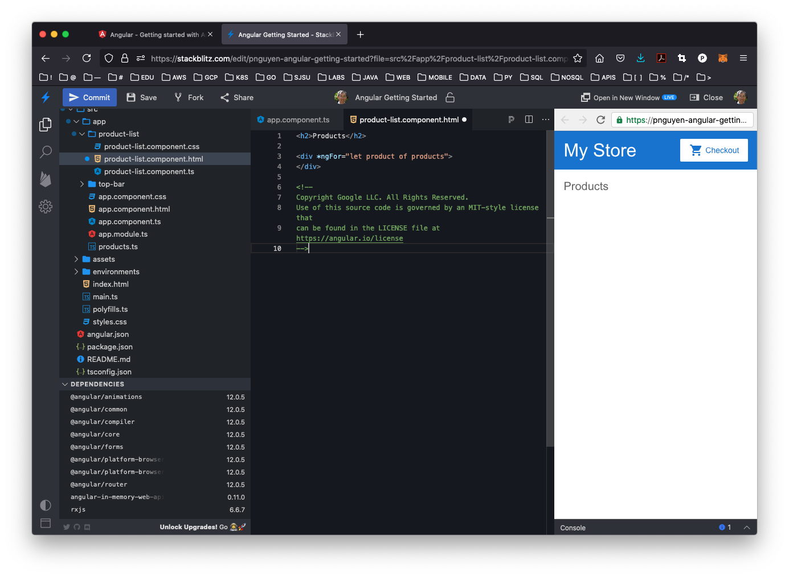


3. Inside the ```<div>```, add an ```<h3>``` and ```{{ product.name }}```. The ```{{ product.name }}``` statement is an example of Angular's interpolation syntax. Interpolation ```{{ }}``` lets you render the property value as text.

* src/app/product-list/product-list.component.html

```
<h2>Products</h2>
<div *ngFor="let product of products">
  <h3>
      {{ product.name }}
  </h3>
</div>
```

* The preview pane updates to display the name of each product in the list.

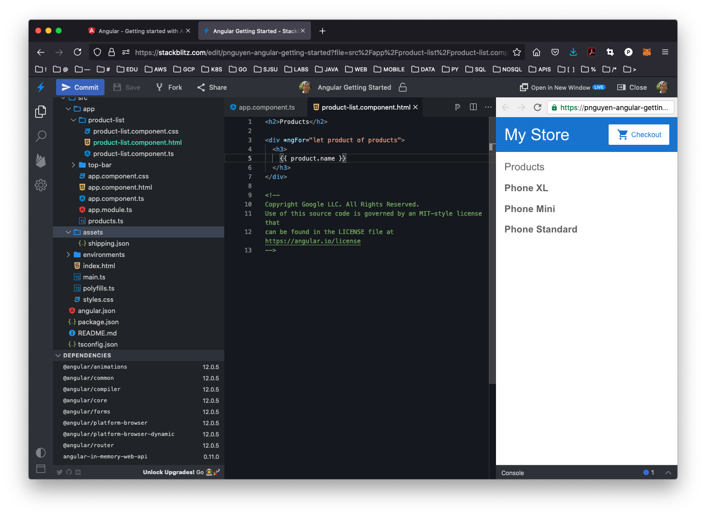


4. To make each product name a link to product details, add the ```<a>``` element around ```{{ product.name }}```.

5. Set the title to be the product's name by using the property binding ```[ ]``` syntax, as follows:

* src/app/product-list/product-list.component.html

```
<h2>Products</h2>
<div *ngFor="let product of products">
  <h3>
    <a [title]="product.name + ' details'">
      {{ product.name }}
    </a>
  </h3>
</div>
```

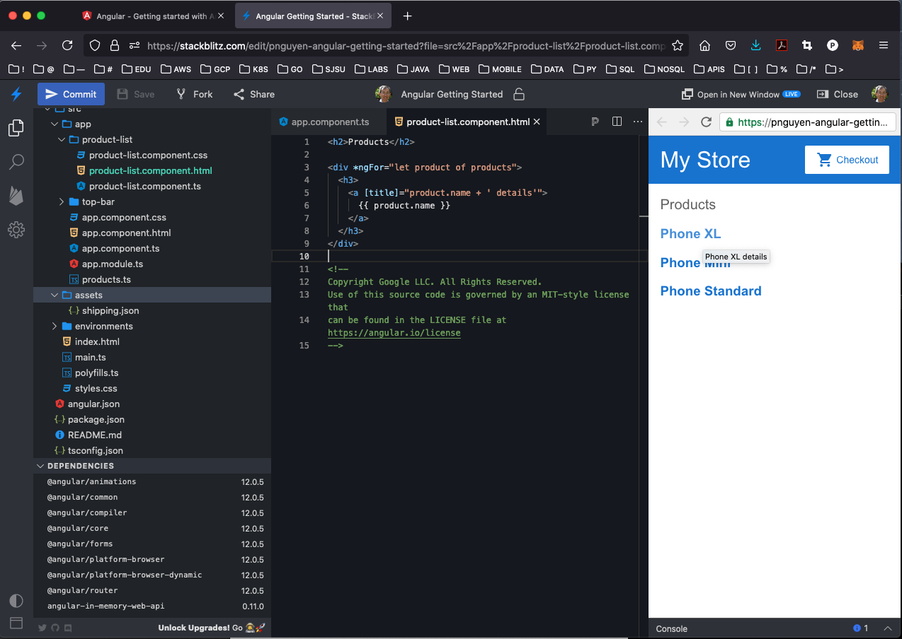

* In the preview pane, hover over a product name to see the bound name property value, which is the product name plus the word "details". Property binding ```[ ]``` lets you use the property value in a template expression.

6. Add the product descriptions. On a ```<p>``` element, use an ```*ngIf``` directive so that Angular only creates the ```<p>``` element if the current product has a description.

* src/app/product-list/product-list.component.html

```
<h2>Products</h2>
<div *ngFor="let product of products">
  <h3>
    <a [title]="product.name + ' details'">
      {{ product.name }}
    </a>
  </h3>
  <p *ngIf="product.description">
    Description: {{ product.description }}
  </p>
</div>
```

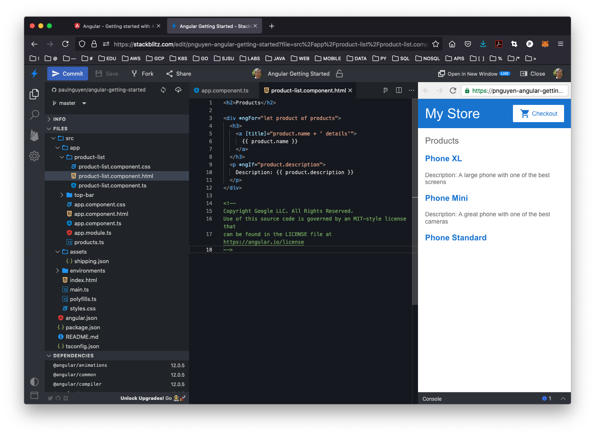

* The application now displays the name and description of each product in the list. Notice that the final product does not have a description paragraph. Angular doesn't create the ```<p>``` element because the product's description property is empty.


7. Add a button so users can share a product. Bind the button's click event to the ```share()``` method in ```product-list.component.ts```. Event binding uses a set of parentheses, ```( )```, around the event, as in the ```(click)``` event on the ```<button>``` element.

* src/app/product-list/product-list.component.html

```
<h2>Products</h2>
<div *ngFor="let product of products">
  <h3>
    <a [title]="product.name + ' details'">
      {{ product.name }}
    </a>
  </h3>
  <p *ngIf="product.description">
    Description: {{ product.description }}
  </p>
  <button (click)="share()">
    Share
  </button>
</div>
```


* Each product now has a Share button.

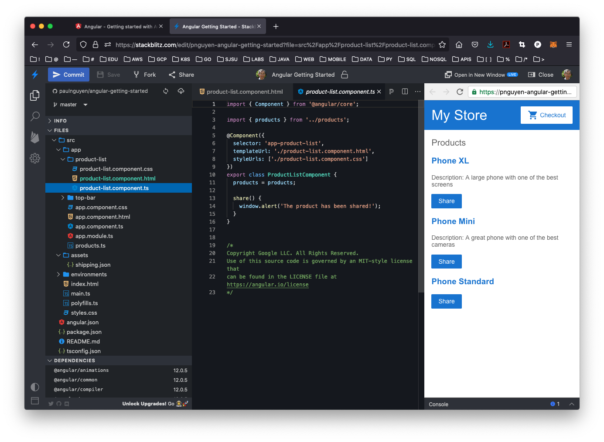

*  Clicking the Share button triggers an alert that states, "The product has been shared!".

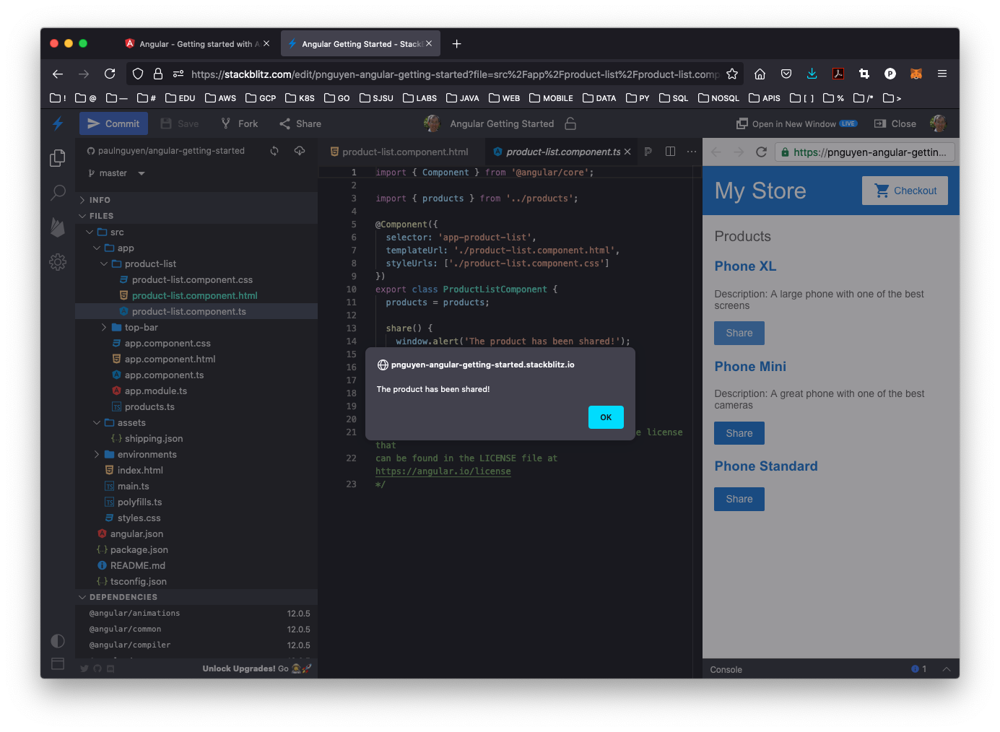

In editing the template, you have explored some of the most popular features of Angular templates. For more information, see Introduction to components and templates.

* https://angular.io/guide/architecture-components#template-syntax


### Pass data to a child component

Currently, the product list displays the name and description of each product. The ```ProductListComponent``` also defines a ```products property``` that contains imported data for each product from the products array in ```products.ts```.

The next step is to create a new alert feature that uses product data from the ```ProductListComponent```. The alert checks the product's price, and, if the price is greater than $700, displays a Notify Me button that lets users sign up for notifications when the product goes on sale.

This section walks you through creating a child component, ```ProductAlertsComponent``` that can receive data from its parent component, ```ProductListComponent```.

1. Right click on the app folder and use the Angular Generator to generate a new component named ```product-alerts```.

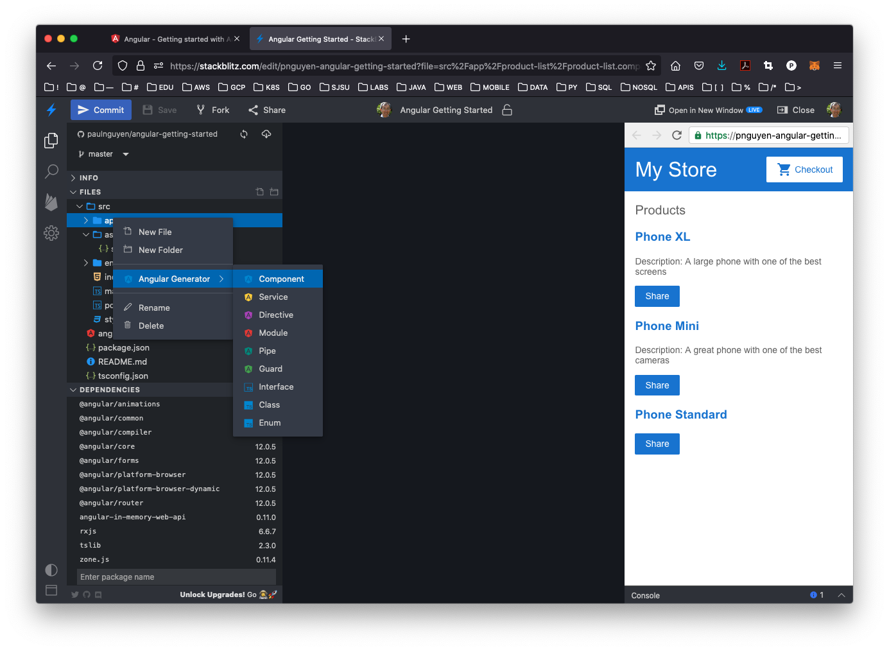
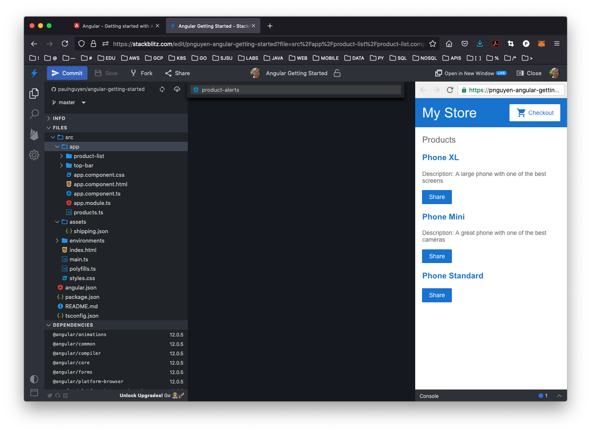
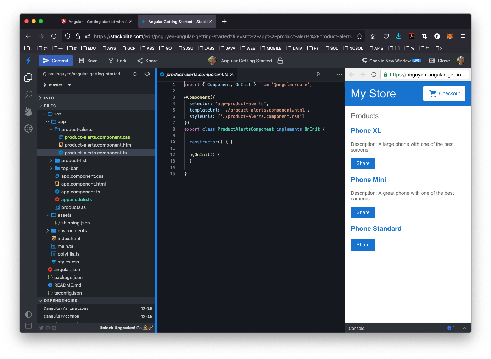

*  The generator creates starter files for the three parts of the component:
   * product-alerts.component.ts
   * product-alerts.component.html
   * product-alerts.component.css

2. Open ```product-alerts.component.ts```. The ```@Component()``` decorator indicates that the following class is a component. ```@Component()``` also provides metadata about the component, including its selector, templates, and styles.

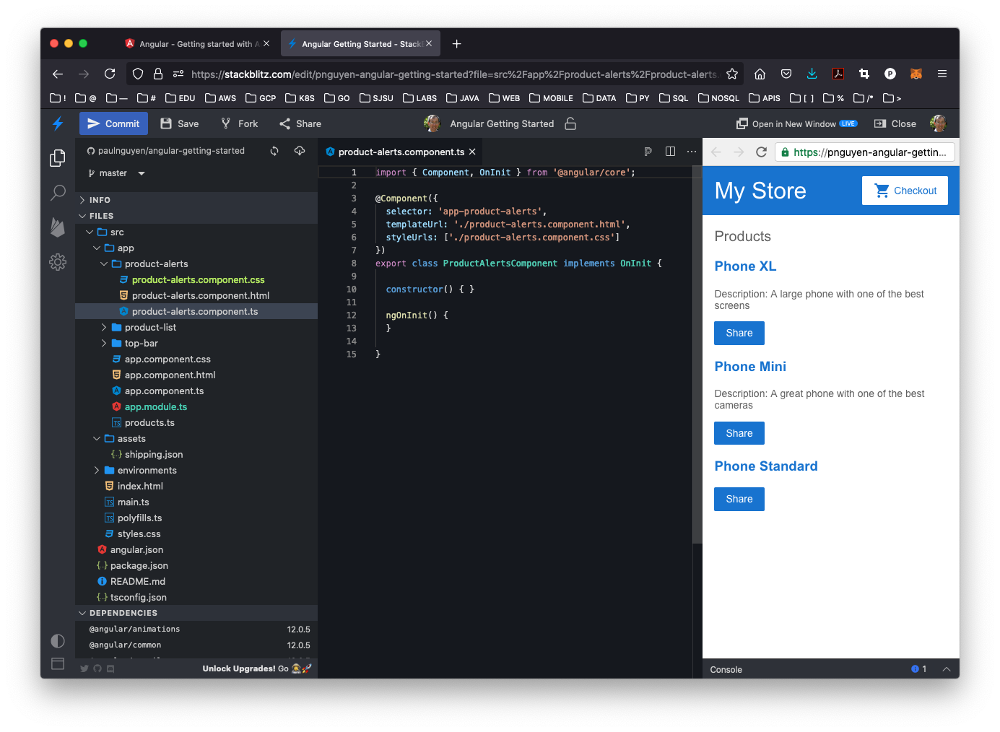

* Key features in the ```@Component()``` are as follows:
  * The selector, ```app-product-alerts```, identifies the component. By convention, Angular component selectors begin with the prefix ````app-```, followed by the component name.
  * The template and style filenames reference the component's HTML and CSS.
  * The ```@Component()``` definition also exports the class, ProductAlertsComponent, which handles functionality for the component.

3. To set up ```ProductAlertsComponent``` to receive product data, first import Input from ```@angular/core```.

* src/app/product-alerts/product-alerts.component.ts

```
import { Component, OnInit } from '@angular/core';
import { Input } from '@angular/core';
import { Product } from '../products';
```

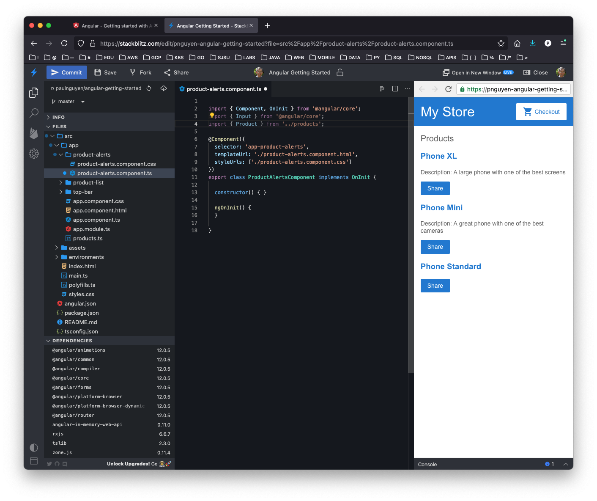


4. In the ```ProductAlertsComponent``` class definition, define a property named ```product``` with an ```@Input()``` decorator. The @Input() decorator indicates that the property value passes in from the component's parent, ```ProductListComponent```.

* src/app/product-alerts/product-alerts.component.ts

```
export class ProductAlertsComponent implements OnInit {
  @Input() product!: Product;
  constructor() { }

  ngOnInit() {
  }

}
```

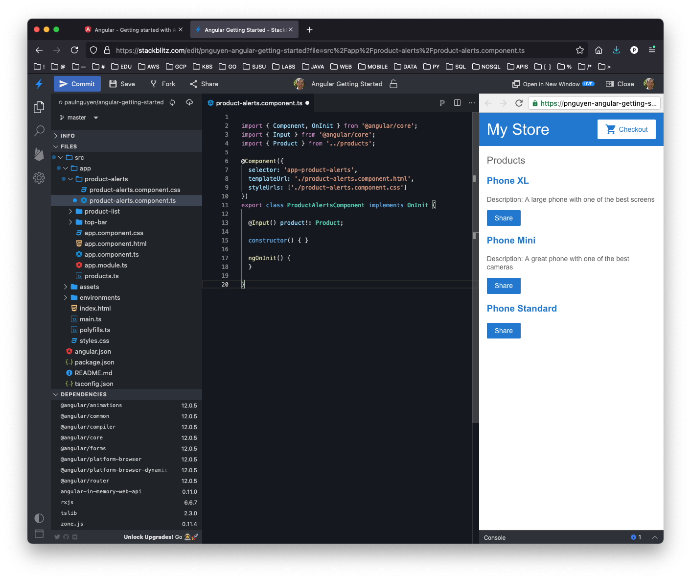

5. Open ```product-alerts.component.html``` and replace the placeholder paragraph with a ```Notify Me``` button that appears if the product price is over $700.

* src/app/product-alerts/product-alerts.component.html

```
<p *ngIf="product && product.price > 700">
  <button>Notify Me</button>
</p>
```

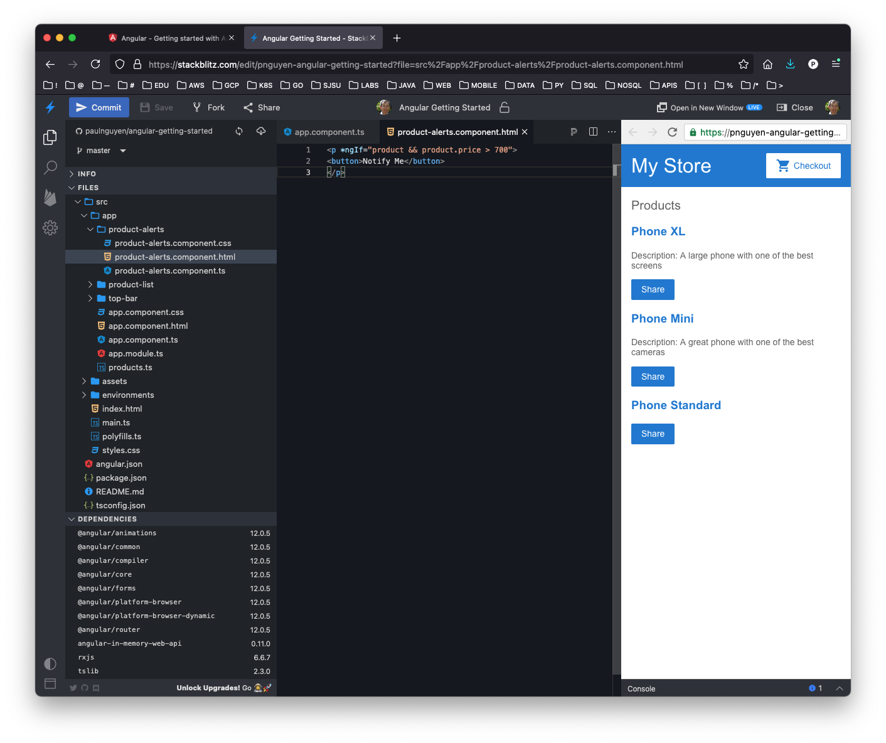

6. To display ```ProductAlertsComponent`` as a child of ```ProductListComponent```, add the selector, ```<app-product-alerts>``` to ```product-list.component.html```. Pass the current product as input to the component using property binding.

* src/app/product-list/product-list.component.html

```
<button (click)="share()">
  Share
</button>

<app-product-alerts
  [product]="product">
</app-product-alerts>
```

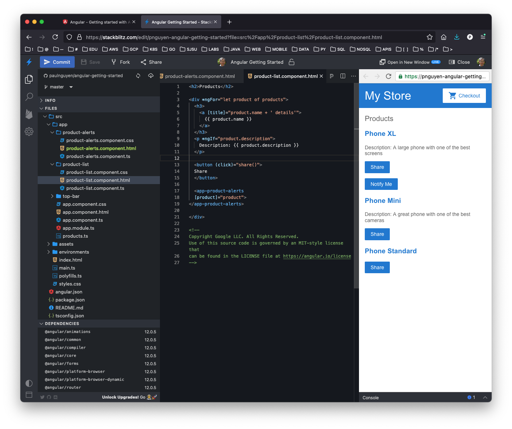

* The new product alert component takes a product as input from the product list. With that input, it shows or hides the Notify Me button, based on the price of the product. The Phone XL price is over $700, so the Notify Me button appears on that product.


### Pass data to a parent component

To make the Notify Me button work, the child component needs to notify and pass the data to the parent component. The ```ProductAlertsComponent``` needs to emit an event when the user clicks Notify Me and the ```ProductListComponent``` needs to respond to the event.

> In new components, the Angular Generator includes an empty constructor(), the OnInit interface, and the ngOnInit() method. Since these steps don't use them, the following code examples omit them for brevity.

1. In ```product-alerts.component.ts```, import ```Output``` and ```EventEmitter``` from ```@angular/core```.

* src/app/product-alerts/product-alerts.component.ts

```
import { Component } from '@angular/core';
import { Input } from '@angular/core';
import { Output, EventEmitter } from '@angular/core';
import { Product } from '../products';
```

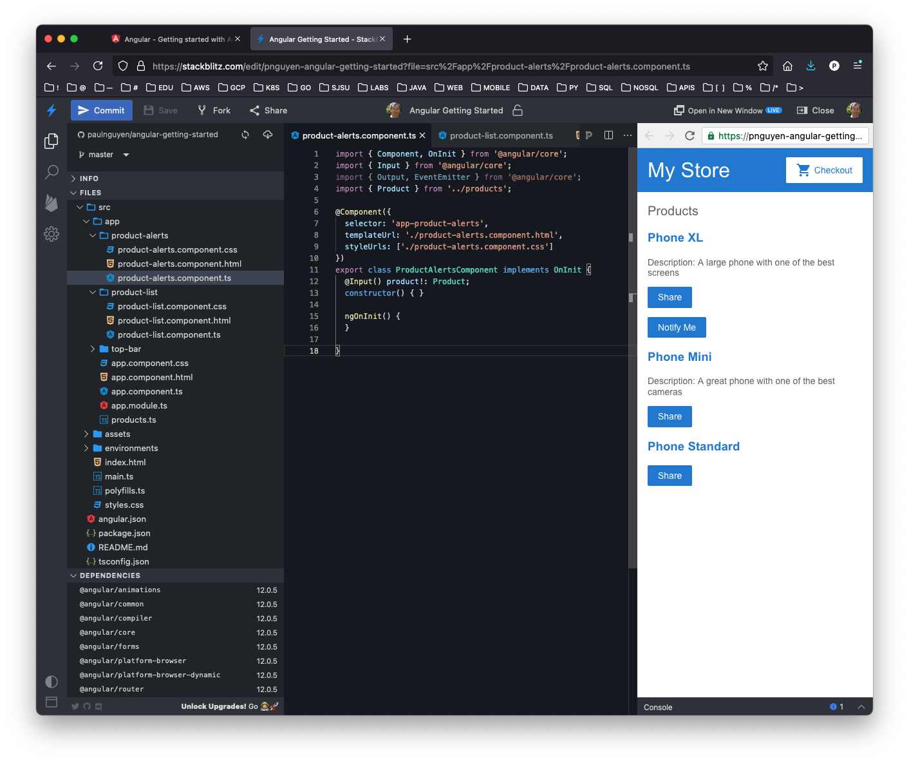

2. In the component class, define a property named notify with an ```@Output()``` decorator and an instance of ```EventEmitter()```. Configuring ```ProductAlertsComponent``` with an ```@Output()`` allows the ```ProductAlertsComponent``` to emit an event when the value of the notify property changes.

* src/app/product-alerts/product-alerts.component.ts

```
export class ProductAlertsComponent {
  @Input() product: Product|undefined;
  @Output() notify = new EventEmitter();
}
```


3. In ```product-alerts.component.html```, update the Notify Me button with an event binding to call the ``notify.emit()``` method.

* src/app/product-alerts/product-alerts.component.html

```
<p *ngIf="product && product.price > 700">
  <button (click)="notify.emit()">Notify Me</button>
</p>
```

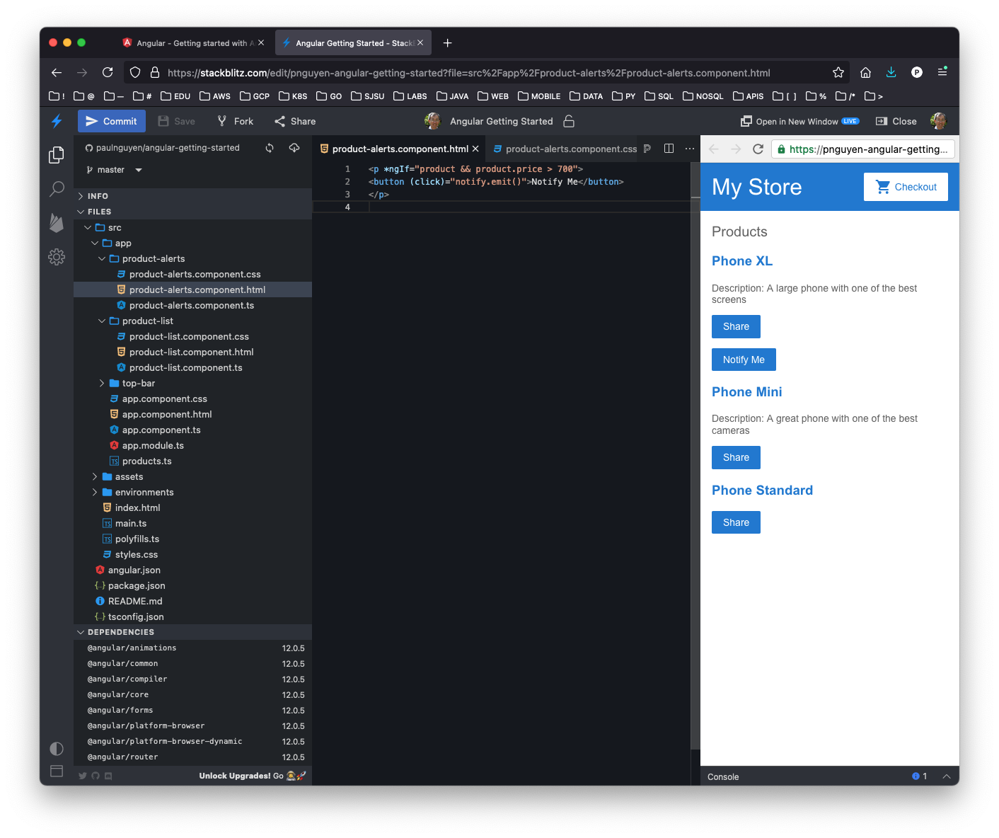

4. Define the behavior that happens when the user clicks the button. The parent, ```ProductListComponent``` (not the ProductAlertsComponent) acts when the child raises the event. In ```product-list.component.ts```, define an ```onNotify()``` method, similar to the ```share()``` method.

* src/app/product-list/product-list.component.ts

```
export class ProductListComponent {
  products = products;

  share() {
    window.alert('The product has been shared!');
  }

  onNotify() {
    window.alert('You will be notified when the product goes on sale');
  }
}
```

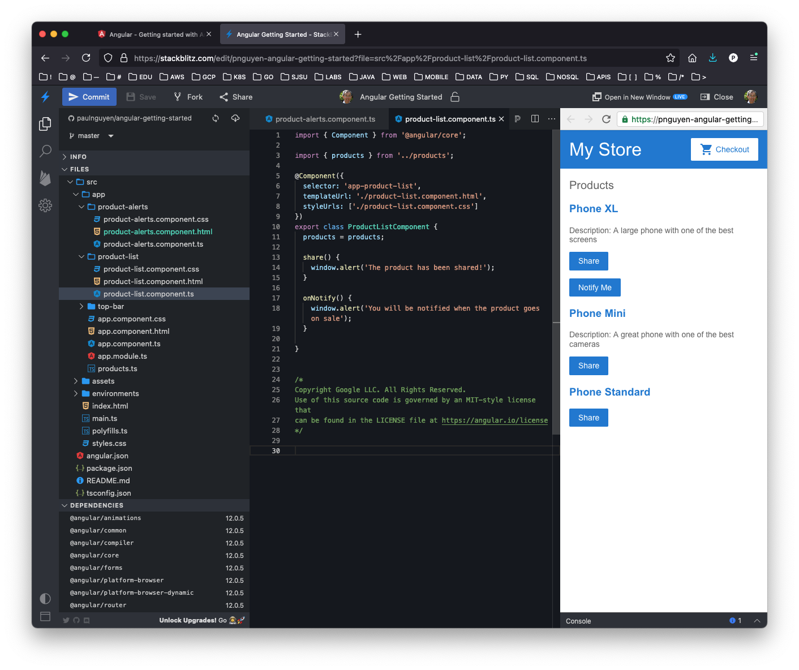


5. Update the ```ProductListComponent``` to receive data from the ```ProductAlertsComponent```.  In ```product-list.component.html```, bind ```<app-product-alerts>``` to the ```onNotify()``` method of the product list component. ```<app-product-alerts>``` is what displays the Notify Me button.

* src/app/product-list/product-list.component.html

```
<button (click)="share()">
  Share
</button>

<app-product-alerts
  [product]="product" 
  (notify)="onNotify()">
</app-product-alerts>
```

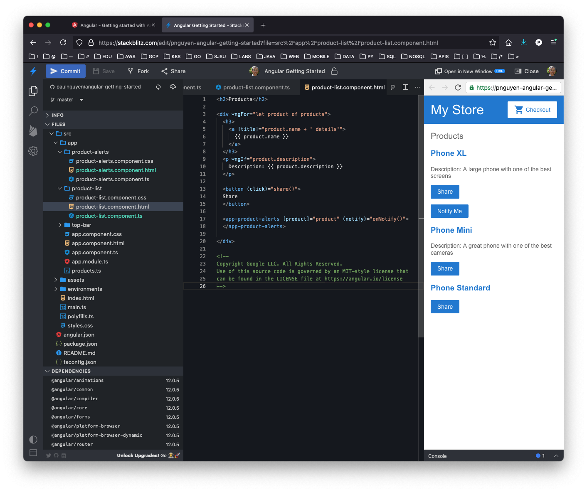


6. Click the Notify Me button to trigger an alert which reads, "You will be notified when the product goes on sale".


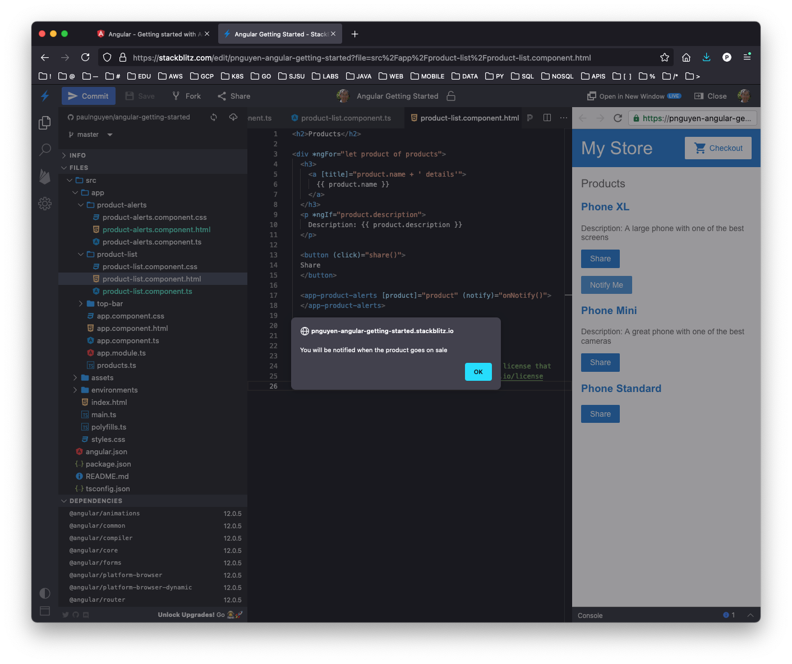


For more information on communication between components, see Component Interaction.

* https://angular.io/guide/component-interaction


## Adding Navigation 

* https://angular.io/start/start-routing

This guide builds on the first step of the Getting Started tutorial, Get started with a basic Angular app.

At this stage of development, the online store application has a basic product catalog.

In the following sections, you'll add the following features to the application:

* Type a URL in the address bar to navigate to a corresponding product page.
* Click links on the page to navigate within your single-page application.
* Click the browser's back and forward buttons to navigate the browser history intuitively.

### Associate a URL path with a component

The application already uses the Angular ```Router``` to navigate to the ```ProductListComponent```. This section shows you how to define a route to show individual product details.

1. Generate a new component for product details. In the file list, right-click the app folder, choose ```Angular Generator``` and Component. Name the component ```product-details```.

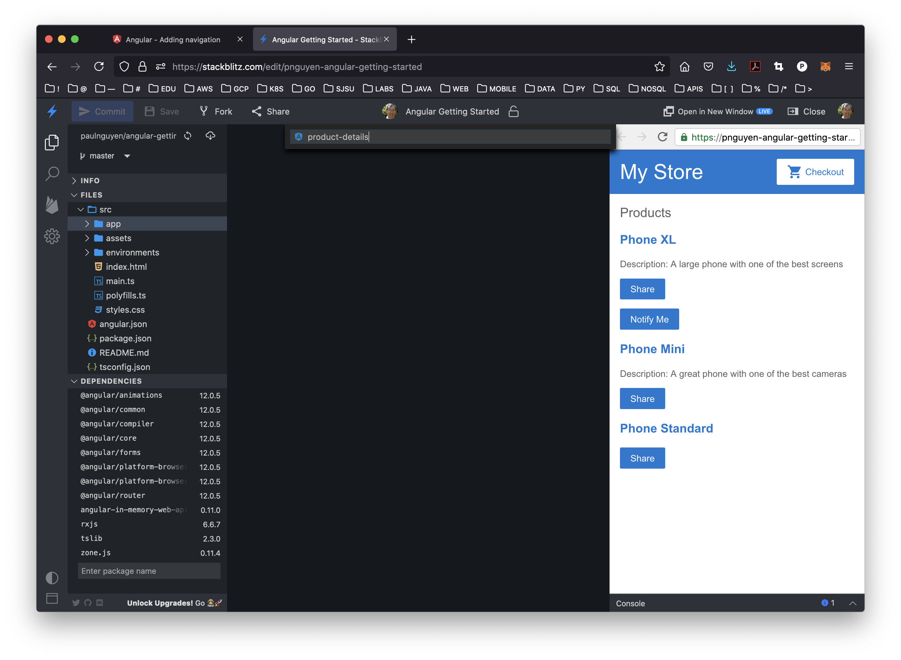
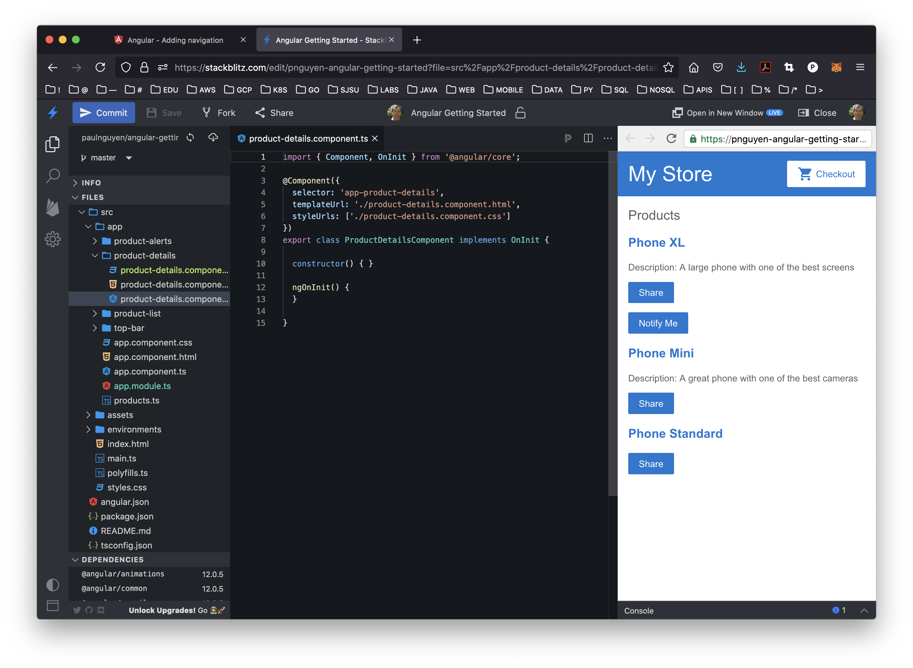

2. In ```app.module.ts```, add a route for product details, with a path of ```products/:productId``` and ```ProductDetailsComponent``` for the component.

* src/app/app.module.ts

```
@NgModule({
  imports: [
    BrowserModule,
    ReactiveFormsModule,
    RouterModule.forRoot([
      { path: '', component: ProductListComponent },
      { path: 'products/:productId', component: ProductDetailsComponent },
    ])
  ],
```

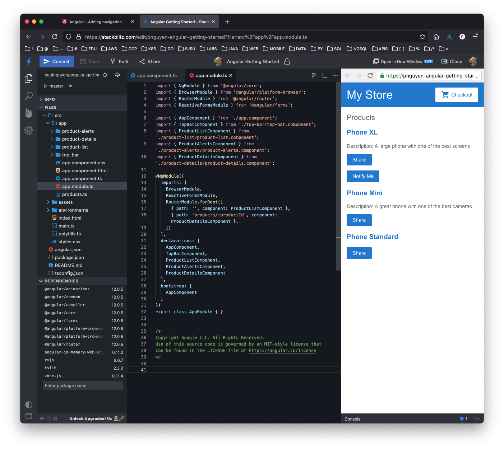


3. Open product-list.component.html.

4. Modify the product name anchor to include a routerLink with the product.id as a parameter.

* src/app/product-list/product-list.component.html

```
<div *ngFor="let product of products">

  <h3>
    <a [title]="product.name + ' details'" [routerLink]="['/products', product.id]">
      {{ product.name }}
    </a>
  </h3>

<!-- . . . -->

</div>
```

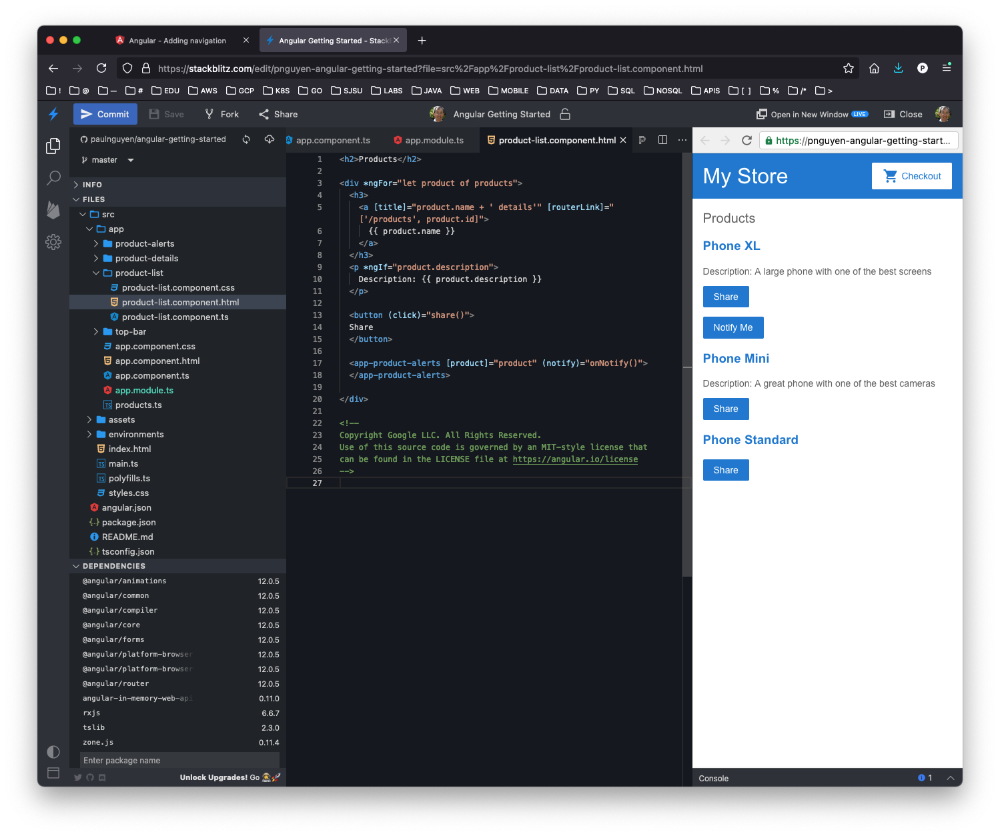

* The ```RouterLink``` directive helps you customize the anchor element. In this case, the route, or URL, contains one fixed segment, ```/products```. The final segment is variable, inserting the id property of the current product. For example, the URL for a product with an id of 1 would be similar to ```https://getting-started-myfork.stackblitz.io/products/1```.


5. Verify that the router works as intended by clicking the product name. The application should display the ```ProductDetailsComponent```, which currently says "product-details works!"

6. Notice that the URL in the preview window changes. The final segment is ```products/#``` where # is the number of the route you clicked.

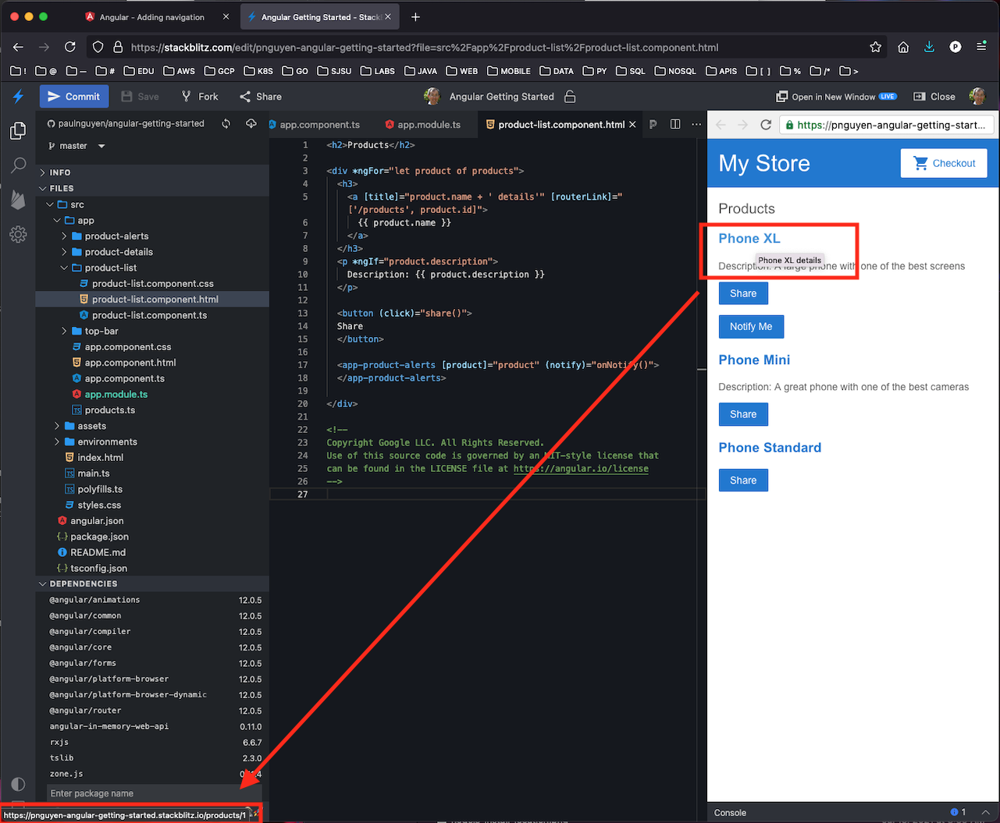


### View product details

The ProductDetailsComponent handles the display of each product. The Angular Router displays components based on the browser's URL and your defined routes.

In this section, you'll use the Angular Router to combine the products data and route information to display the specific details for each product.

1. In ```product-details.component.ts```, import ActivatedRoute from ```@angular/router```, and the products array from ```../products```.

* src/app/product-details/product-details.component.ts

```
import { Component, OnInit } from '@angular/core';
import { ActivatedRoute } from '@angular/router';

import { Product, products } from '../products';
```

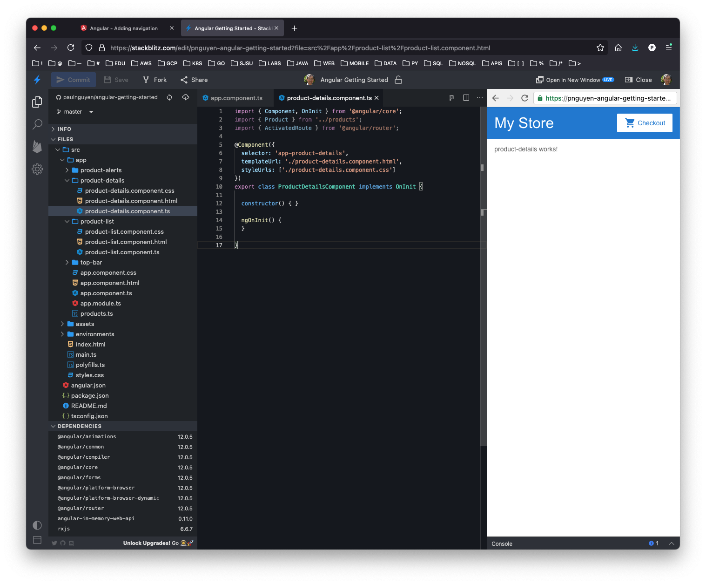

2. Define the product property.

* src/app/product-details/product-details.component.ts

```
export class ProductDetailsComponent implements OnInit {
  product: Product|undefined;
  /* ... */
}
```

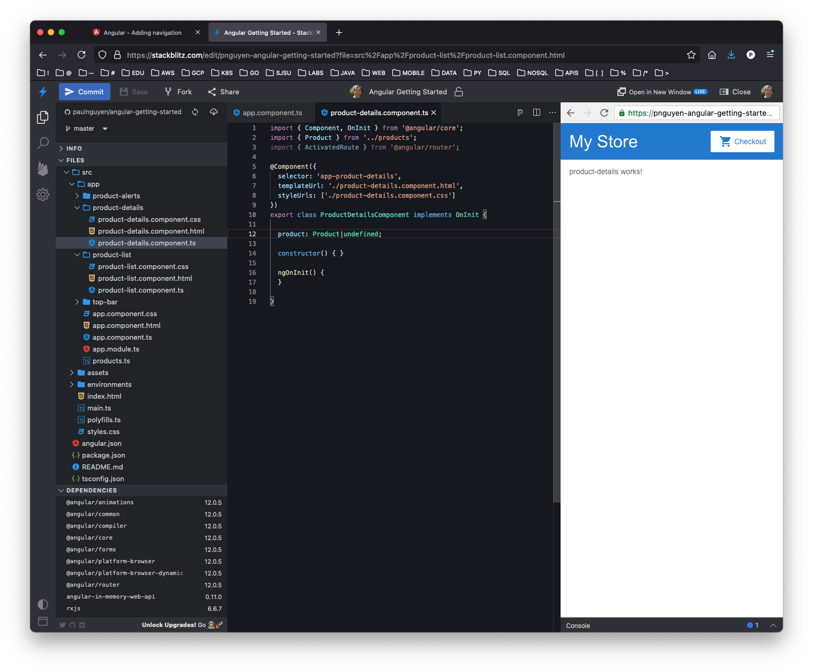

3. Inject ```ActivatedRoute``` into the ```constructor()``` by adding private route: ```ActivatedRoute``` as an argument within the constructor's parentheses.

* src/app/product-details/product-details.component.ts

```
export class ProductDetailsComponent implements OnInit {
  product: Product|undefined;

  constructor(
    private route: ActivatedRoute,
  ) { }

}
```

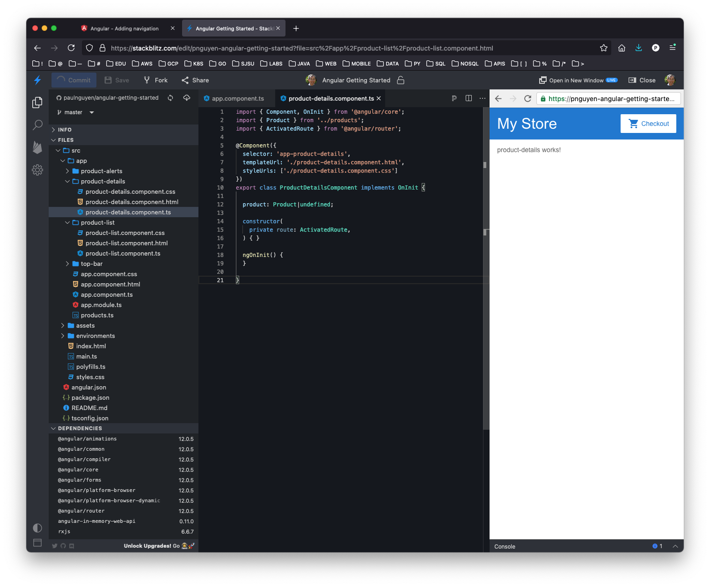


* ```ActivatedRoute``` is specific to each component that the Angular Router loads. ActivatedRoute contains information about the route and the route's parameters.

By injecting ```ActivatedRoute```, you are configuring the component to use a service. The ```Managing Data``` step covers services in more detail.


4. In the ```ngOnInit()``` method, extract the ```productId``` from the route parameters and find the corresponding product in the ```products``` array.

* src/app/product-details/product-details.component.ts

```
ngOnInit() {
  // First get the product id from the current route.
  const routeParams = this.route.snapshot.paramMap;
  const productIdFromRoute = Number(routeParams.get('productId'));

  // Find the product that correspond with the id provided in route.
  this.product = products.find(product => product.id === productIdFromRoute);
}
```

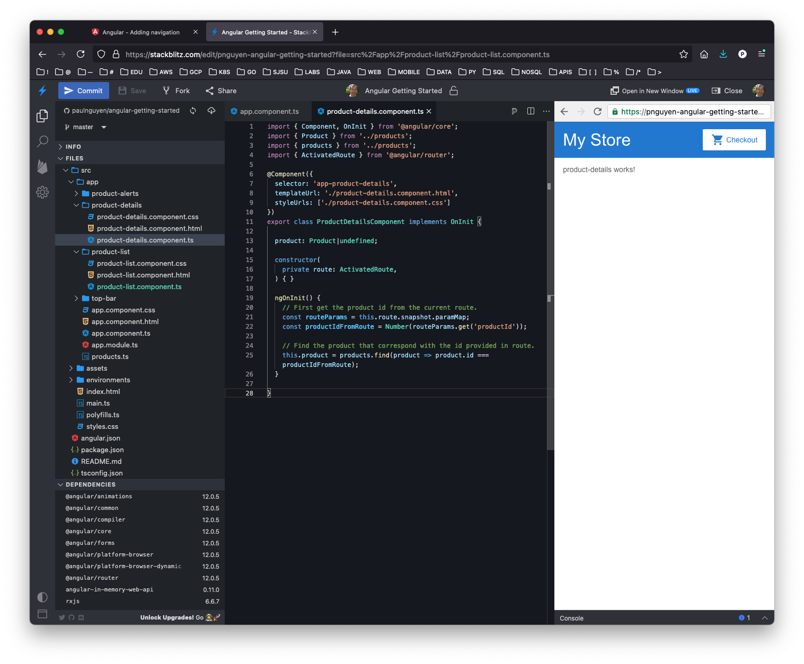

The route parameters correspond to the path variables you define in the route. To access the route parameters, we use ```route.snapshot```, which is the ```ActivatedRouteSnapshot``` that contains information about the active route at that particular moment in time. The URL that matches the route provides the ```productId``` . Angular uses the ```productId``` to display the details for each unique product.

5. Update the ```ProductDetailsComponent``` template to display product details with an ```*ngIf```. If a product exists, the ```<div>``` renders with a name, price, and description.

* src/app/product-details/product-details.component.html

```
<h2>Product Details</h2>

<div *ngIf="product">

  <h3>{{ product.name }}</h3>
  <h4>{{ product.price | currency }}</h4>
  <p>{{ product.description }}</p>

</div>
```


* The line, ```<h4>{{ product.price | currency }}</h4>```, uses the ```currency``` pipe to transform product.price from a number to a currency string. A pipe is a way you can transform data in your HTML template. For more information about Angular pipes, see ```Pipes``.

* https://angular.io/guide/pipes

When users click on a name in the product list, the router navigates them to the distinct URL for the product, shows the ```ProductDetailsComponent```, and displays the product details.


For more information about the Angular Router, see ```Routing & Navigation```.

* https://angular.io/guide/router

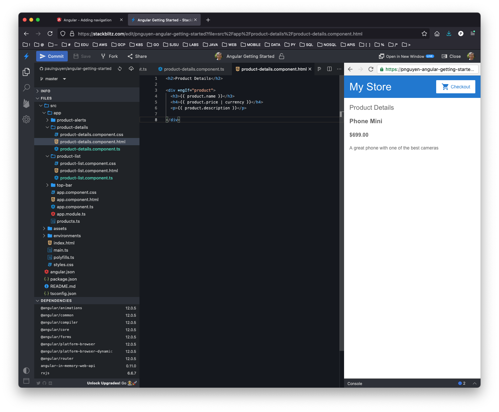


### What's next

You have configured your application so you can view product details, each with a distinct URL.

To continue exploring Angular:

* Continue to Managing Data to add a shopping cart feature, manage cart data, and retrieve external data for shipping prices.

* Skip ahead to Deployment to deploy your application to Firebase or move to local development.


## Managing data

* https://angular.io/start/start-data

This guide builds on the second step of the Getting started with a basic Angular application tutorial, Adding navigation. At this stage of development, the store application has a product catalog with two views: a product list and product details. Users can click on a product name from the list to see details in a new view, with a distinct URL, or route.

This step of the tutorial guides you through creating a shopping cart in the following phases:

* Update the product details view to include a Buy button, which adds the current product to a list of products that a cart service manages.

* Add a cart component, which displays the items in the cart.

* Add a shipping component, which retrieves shipping prices for the items in the cart by using Angular's ```HttpClient``` to retrieve shipping data from a ```.json``` file.


### Create the shopping cart service

In Angular, a service is an instance of a class that you can make available to any part of your application using Angular's dependency injection system.

* https://angular.io/guide/glossary#dependency-injection-di

Currently, users can view product information, and the application can simulate sharing and notifications about product changes.

The next step is to build a way for users to add products to a cart. This section walks you through adding a Buy button and setting up a cart service to store information about products in the cart.

### Define a cart service

1. To generate a cart service, right click on the ```app``` folder, choose ```Angular Generator```, and choose ```Service```. Name the new service ```cart```.

* src/app/cart.service.ts

```
import { Injectable } from '@angular/core';

@Injectable({
  providedIn: 'root'
})
export class CartService {

  constructor() {}

}
```

2. Import the ```Product``` interface from ```./products.js```.

3. In the ```CartService``` class, define an ```items``` property to store the array of the current products in the cart.

* src/app/cart.service.ts

```
import { Product } from './products';
/* . . . */
export class CartService {
  items: Product[] = [];
/* . . . */
}
```


